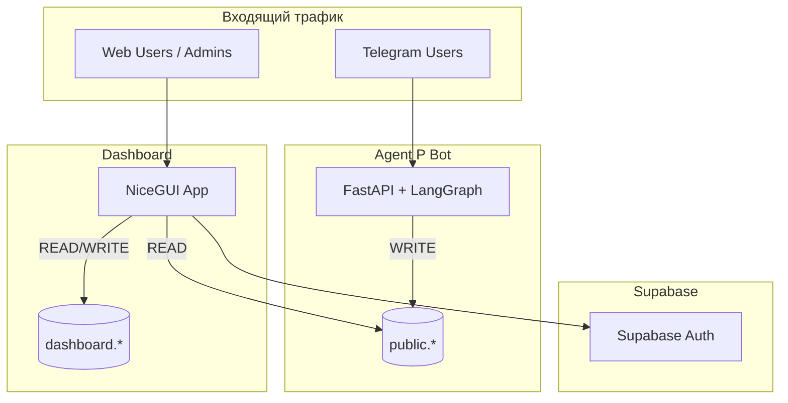

# Архитектура системы Agent P Dashboard

## 1. Видение

Agent P Dashboard — это **пункт управления** для владельцев и администраторов салонов красоты. Дашборд является частью экосистемы Agent P и работает с единой базой данных.

```
┌─────────────────────────────────────────────────────────────────────┐
│                       AGENT P ECOSYSTEM                             │
├─────────────────────────────────────────────────────────────────────┤
│                                                                     │
│   🤖 Agent P (Bot)          📊 Dashboard            📱 Mini App      │
│   ─────────────────         ─────────────           ───────────     │
│   Python / Aiogram          Python / NiceGUI        React / TG SDK  │
│   Клиенты (Chat)            Админ (Web)             Клиенты (GUI)   │
│   ✅ Production             🚧 В разработке          📝 Deferred     │
│                                                                     │
└─────────────────────────────────────────────────────────────────────┘
```

---

## 2. Ключевое техническое решение

### Стратегия: Python Native Ecosystem

Мы выбираем **NiceGUI** (на базе FastAPI) для создания дашборда.

| Критерий | Решение |
|----------|---------|
| **Язык** | Python 3.11+ (единый стек с ботом) |
| **UI Framework** | NiceGUI (Quasar/Material components) |
| **Backend** | FastAPI (встроен в NiceGUI) |
| **Database** | Supabase (PostgreSQL) |
| **Auth** | Supabase Auth + собственная таблица users |
| **Realtime** | Supabase Realtime (WebSockets) |
| **Deploy** | Docker + Coolify |

### Преимущества NiceGUI

| Преимущество | Описание |
|--------------|----------|
| 🚀 **Скорость разработки** | UI пишется как Python-код, работает как SPA |
| 🔄 **Единый стек** | Переиспользуем Pydantic модели, ORM, утилиты из бота |
| 🔌 **Realtime из коробки** | Встроенные WebSockets для "живых" обновлений |
| 💎 **Готовый UI Kit** | Material Design компоненты (cards, tables, charts) |
| 🐍 **Python-only** | Не нужен JavaScript/React для MVP |

---

## 3. Архитектура компонентов



---

## 4. Разделение ответственности

### 4.1 Agent P (Bot) — Операционист

**Зона ответственности:**
- Обработка сообщений клиентов
- Бронирование через YClients API
- Запись данных в `public.*`

**Таблицы (WRITE):**
- `active_sessions_v2` — горячие сессии
- `conversation_sessions_v2` — архив диалогов
- `clients_v2` — профили клиентов
- `wishlist_v2` — лист ожидания
- `user_ltm_v2` — долгосрочная память

### 4.2 Dashboard — Пункт управления

**Зона ответственности:**
- Отображение аналитики и KPI
- Просмотр диалогов бота
- Управление листом ожидания
- Настройка тенантов

**Таблицы:**
- `public.*` — **READ ONLY** (данные бота)
- `dashboard.*` — **READ/WRITE** (собственные данные)

### 4.3 Mini App — Личный кабинет клиента

> [!NOTE]
> **DEFERRED** — отложено до Phase 3. См. [07_PHASE3_MINIAPP.md](./07_PHASE3_MINIAPP.md)

---

## 5. Потоки данных

### 5.1 Основной поток (Bot → Dashboard)

```
[Клиент] → [Telegram] → [Agent P Bot]
                              ↓
                        [Supabase public.*]
                              ↓
                        [Dashboard] ← [Админ]
```

1. Клиент пишет боту в Telegram
2. Bot обрабатывает и сохраняет в `public.*`
3. Dashboard читает данные и отображает аналитику
4. Админ видит статистику, диалоги, wishlist

### 5.2 Управляющий поток (Dashboard → Bot)

```
[Админ] → [Dashboard] → [Supabase dashboard.*]
                              ↓
                        [Prefect Job / Webhook]
                              ↓
                        [Agent P Bot] → [Telegram]
```

1. Админ изменяет настройки или запускает рассылку
2. Dashboard записывает в `dashboard.*`
3. Prefect Job или Webhook триггерит бота
4. Bot отправляет сообщение клиенту

---

## 6. Принципы разработки

### 6.1 Single Source of Truth

- Все данные клиентов хранятся в Supabase
- Dashboard **не дублирует** данные бота
- Метрики агрегируются через SQL Views или Prefect Jobs

### 6.2 Schema Separation

| Схема | Владелец | Dashboard доступ |
|-------|----------|------------------|
| `public` | Agent P Bot | READ ONLY |
| `dashboard` | Dashboard | READ/WRITE |

### 6.3 Idempotent Operations

- Все операции Dashboard должны быть идемпотентными
- Повторный клик не создаёт дубликаты

### 6.4 Graceful Degradation

- Если Bot недоступен → Dashboard продолжает работать (read-only режим)
- Если Supabase Realtime падает → fallback на polling

---

## 7. Структура проекта

```
agent-p-dashboard/
├── main.py                 # Точка входа NiceGUI
├── config.py               # Конфигурация (env vars)
├── auth.py                 # Авторизация и middleware
├── data.py                 # Supabase queries (Data Access Layer)
├── models.py               # Pydantic модели
├── pages/
│   ├── __init__.py
│   ├── login.py            # Страница входа
│   ├── overview.py         # 📈 Обзор (KPI, воронка)
│   ├── sessions.py         # 💬 Диалоги
│   ├── wishlist.py         # 📋 Лист ожидания
│   ├── clients.py          # 👥 Клиенты
│   └── settings.py         # ⚙️ Настройки тенанта
├── components/
│   ├── __init__.py
│   ├── sidebar.py          # Боковое меню
│   ├── kpi_card.py         # Карточка метрики
│   ├── chat_viewer.py      # Просмотр диалога
│   └── funnel_chart.py     # График воронки
├── jobs/
│   └── metrics_collector.py # Prefect job для сбора метрик
├── static/
│   └── logo.png
├── Dockerfile
├── docker-compose.yml
├── requirements.txt
└── README.md
```

---

## 8. Технологический стек (детально)

| Категория | Технология | Версия | Назначение |
|-----------|------------|--------|------------|
| **Runtime** | Python | 3.11+ | Основной язык |
| **Web Framework** | NiceGUI | 2.x | UI + Server |
| **Async HTTP** | httpx | 0.27+ | Supabase client |
| **Database Client** | supabase-py | 2.x | PostgreSQL access |
| **Data Validation** | Pydantic | 2.x | Models & validation |
| **Charts** | ECharts (via NiceGUI) | - | Графики |
| **Auth** | bcrypt + JWT | - | Password hashing |
| **Background Jobs** | Prefect | 3.0 | Scheduled tasks |
| **Containerization** | Docker | - | Deployment |

---

## 9. Связь между документами

| Документ | Описание |
|----------|----------|
| [01_BACKEND.md](./01_BACKEND.md) | Data layer, модели, queries |
| [02_FRONTEND.md](./02_FRONTEND.md) | NiceGUI pages, компоненты |
| [03_DATABASE.md](./03_DATABASE.md) | Схемы БД, миграции |
| [04_INTEGRATIONS.md](./04_INTEGRATIONS.md) | Supabase, Auth, Realtime |
| [05_PHASE1_MVP.md](./05_PHASE1_MVP.md) | Детальный план Phase 1 |
| [06_PHASE2_FEATURES.md](./06_PHASE2_FEATURES.md) | Phase 2: расширение |
| [07_PHASE3_MINIAPP.md](./07_PHASE3_MINIAPP.md) | Deferred: Mini App |
