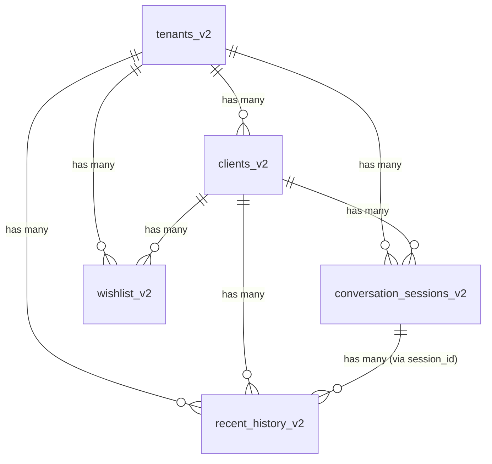

# Agent P Dashboard: Data Standard

> **Цель документа**: Определить стандарт данных, которые бот должен записывать в Supabase, чтобы дашборд мог корректно отображать все метрики, сессии, wishlist и конверсии.

---

## 🔴 Критические проблемы (требуют исправлений)

| Проблема | Таблица | Описание | Влияние на дашборд |
|----------|---------|----------|-------------------|
| `session_id = NULL` | `recent_history_v2` | Все 3091 сообщений не привязаны к сессиям | Диалоги не отображаются |
| Отсутствует `status` | `wishlist_v2` | Нет колонки для статуса (pending/converted/cancelled) | Wishlist не фильтруется |
| Отсутствует `processed_at` | `wishlist_v2` | Нет даты обработки | Нельзя отменять/конвертировать |
| FK на `active_sessions_v2` | `recent_history_v2` | Ссылается на временные сессии, не на архив | Потеря связи после закрытия сессии |
| Только `auto_closed` | `conversation_sessions_v2` | Нет статуса `done` для успешных бронирований | Воронка не работает |

---

## 1. Таблица `tenants_v2` (Салоны)

### Схема
```sql
CREATE TABLE tenants_v2 (
    id UUID PRIMARY KEY DEFAULT gen_random_uuid(),
    name TEXT NOT NULL,                    -- "Serebro Nail Studio"
    slug TEXT,                             -- "serebro-nail" (optional)
    is_active BOOLEAN NOT NULL DEFAULT true,
    metadata JSONB NOT NULL DEFAULT '{}',  -- Настройки салона
    created_at TIMESTAMPTZ NOT NULL DEFAULT now(),
    updated_at TIMESTAMPTZ NOT NULL DEFAULT now()
);
```

### Обязательные поля
| Поле | Тип | Обязательно | Описание |
|------|-----|-------------|----------|
| `id` | UUID | ✅ | Уникальный идентификатор салона |
| `name` | TEXT | ✅ | Название салона для отображения |
| `metadata` | JSONB | ✅ | Настройки (YClients, Telegram, etc.) |

### Структура `metadata`
```json
{
  "yclients": {
    "company_id": "123456",
    "branch_id": "789012",
    "user_token": "encrypted_token"
  },
  "telegram": {
    "admin_chat_id": "-1001234567890"
  },
  "settings": {
    "closing_time": "21:00",
    "enable_gap_filtering": true
  }
}
```

---

## 2. Таблица `clients_v2` (Клиенты)

### Схема
```sql
CREATE TABLE clients_v2 (
    id UUID PRIMARY KEY DEFAULT gen_random_uuid(),
    tenant_id UUID NOT NULL REFERENCES tenants_v2(id),
    telegram_chat_id BIGINT,               -- Telegram user ID
    whatsapp_id TEXT,                      -- WhatsApp phone
    phone TEXT,                            -- Телефон для YClients
    yclients_client_id BIGINT,             -- ID в YClients
    full_name TEXT,                        -- ФИО клиента
    meta JSONB NOT NULL DEFAULT '{}',
    created_at TIMESTAMPTZ NOT NULL DEFAULT now(),
    updated_at TIMESTAMPTZ NOT NULL DEFAULT now()
);
```

### Обязательные поля для дашборда
| Поле | Тип | Обязательно | Используется в |
|------|-----|-------------|----------------|
| `id` | UUID | ✅ | Связь с sessions, wishlist, history |
| `tenant_id` | UUID | ✅ | Фильтрация по салону |
| `full_name` | TEXT | ⚠️ Желательно | Отображение в таблицах сессий |

---

## 3. Таблица `conversation_sessions_v2` (Сессии диалогов)

> **Используется для**: KPI, воронка конверсий, список сессий

### Схема
```sql
CREATE TABLE conversation_sessions_v2 (
    id BIGSERIAL PRIMARY KEY,
    session_id UUID NOT NULL UNIQUE,       -- ⚠️ КРИТИЧНО для связи с history
    tenant_id UUID NOT NULL REFERENCES tenants_v2(id),
    user_id UUID NOT NULL REFERENCES clients_v2(id),
    channel TEXT NOT NULL,                 -- 'telegram' | 'whatsapp'
    
    -- Временные метки
    started_at TIMESTAMPTZ NOT NULL,       -- Начало сессии
    ended_at TIMESTAMPTZ,                  -- Конец сессии
    duration_sec INTEGER,                  -- Длительность в секундах
    
    -- Результат сессии (КРИТИЧНО для воронки)
    final_status TEXT NOT NULL,            -- 'done' | 'abandoned' | 'auto_closed'
    final_intent TEXT,                     -- 'booking' | 'info' | 'reschedule' | 'cancel'
    final_summary TEXT,                    -- Краткое описание
    
    -- Данные бронирования (КРИТИЧНО для KPI)
    booking_id TEXT,                       -- ID записи в YClients (NULL = не забронировано)
    booking_source TEXT,                   -- 'bot' | 'manual'
    booking_status TEXT,                   -- 'confirmed' | 'cancelled'
    booking_datetime TIMESTAMPTZ,          -- Дата/время записи
    booking_amount NUMERIC,                -- Сумма услуги (для выручки)
    booking_currency TEXT,                 -- 'RUB'
    
    -- Статистика
    messages_count INTEGER,
    agent_messages_count INTEGER,
    user_messages_count INTEGER,
    
    -- Метаданные (КРИТИЧНО для воронки)
    meta JSONB NOT NULL DEFAULT '{}',
    
    created_at TIMESTAMPTZ NOT NULL DEFAULT now()
);
```

### ⚠️ Обязательные поля для дашборда

| Поле | Тип | Обязательно | Используется для |
|------|-----|-------------|------------------|
| `session_id` | UUID | ✅ | Связь с `recent_history_v2` |
| `tenant_id` | UUID | ✅ | Фильтрация по салону |
| `started_at` | TIMESTAMPTZ | ✅ | Фильтры по дате, сортировка |
| `final_status` | TEXT | ✅ | Воронка конверсий |
| `booking_id` | TEXT | ⚠️ | KPI: количество бронирований |
| `booking_amount` | NUMERIC | ⚠️ | KPI: выручка |
| `meta.drop_off_stage` | JSONB | ⚠️ | Воронка конверсий |

### Допустимые значения `final_status`

| Значение | Описание | Считается успехом |
|----------|----------|-------------------|
| `done` | Сессия завершена успешно | ✅ |
| `abandoned` | Клиент бросил диалог | ❌ |
| `auto_closed` | Закрыто автоматически по таймауту | ❌ |

### Структура `meta` для воронки

```json
{
  "drop_off_stage": "service_selection" | "staff_selection" | "time_selection" | null,
  "services_selected": ["service_id_1", "service_id_2"],
  "staff_id": "4844805",
  "selected_datetime": "2025-01-15T10:00:00"
}
```

| Значение `drop_off_stage` | Этап отвала |
|---------------------------|-------------|
| `null` | Дошёл до конца (done) |
| `service_selection` | Не выбрал услугу |
| `staff_selection` | Не выбрал мастера |
| `time_selection` | Не выбрал время |

---

## 4. Таблица `recent_history_v2` (История сообщений)

> **Используется для**: Просмотр диалогов

### Схема
```sql
CREATE TABLE recent_history_v2 (
    id BIGSERIAL PRIMARY KEY,
    tenant_id UUID NOT NULL REFERENCES tenants_v2(id),
    user_id UUID NOT NULL REFERENCES clients_v2(id),
    session_id UUID REFERENCES conversation_sessions_v2(session_id),  -- ⚠️ КРИТИЧНО!
    role TEXT NOT NULL,                    -- 'user' | 'assistant'
    channel TEXT NOT NULL DEFAULT 'unknown',
    message TEXT NOT NULL,
    meta JSONB NOT NULL DEFAULT '{}',
    created_at TIMESTAMPTZ NOT NULL DEFAULT now()
);
```

### 🔴 КРИТИЧЕСКАЯ ПРОБЛЕМА

**Текущее состояние**: Все 3091 записей имеют `session_id = NULL`

**Требуемое исправление в боте**:
```python
# При сохранении сообщения ОБЯЗАТЕЛЬНО передавать session_id
supabase.table("recent_history_v2").insert({
    "tenant_id": tenant_id,
    "user_id": user_id,
    "session_id": current_session_id,  # ⚠️ НЕ ДОЛЖНО БЫТЬ NULL!
    "role": "user",  # или "assistant"
    "channel": "telegram",
    "message": message_text
}).execute()
```

### Обязательные поля

| Поле | Тип | Обязательно | Описание |
|------|-----|-------------|----------|
| `session_id` | UUID | ✅ **КРИТИЧНО** | Связь с сессией для отображения диалога |
| `role` | TEXT | ✅ | `'user'` или `'assistant'` |
| `message` | TEXT | ✅ | Текст сообщения |
| `created_at` | TIMESTAMPTZ | ✅ | Для сортировки |

---

## 5. Таблица `wishlist_v2` (Лист ожидания)

> **Используется для**: Управление листом ожидания

### Текущая схема (НЕПОЛНАЯ!)
```sql
CREATE TABLE wishlist_v2 (
    id BIGSERIAL PRIMARY KEY,
    tenant_id UUID NOT NULL REFERENCES tenants_v2(id),
    user_id UUID NOT NULL REFERENCES clients_v2(id),
    item_type TEXT NOT NULL,               -- 'slot_waiting'
    item_id TEXT NOT NULL,                 -- 'service_25601439'
    source TEXT,                           -- 'slot_hunter'
    comment TEXT,
    meta JSONB NOT NULL DEFAULT '{}',
    created_at TIMESTAMPTZ NOT NULL DEFAULT now(),
    updated_at TIMESTAMPTZ NOT NULL DEFAULT now()
);
```

### 🔴 ТРЕБУЕТСЯ МИГРАЦИЯ

```sql
-- Добавить недостающие колонки
ALTER TABLE wishlist_v2 
ADD COLUMN IF NOT EXISTS status TEXT NOT NULL DEFAULT 'pending',
ADD COLUMN IF NOT EXISTS processed_at TIMESTAMPTZ,
ADD COLUMN IF NOT EXISTS amount NUMERIC;

-- Добавить constraint на статус
ALTER TABLE wishlist_v2 
ADD CONSTRAINT wishlist_status_check 
CHECK (status IN ('pending', 'converted', 'cancelled'));
```

### Требуемая схема

| Поле | Тип | Обязательно | Описание |
|------|-----|-------------|----------|
| `status` | TEXT | ✅ | `'pending'` / `'converted'` / `'cancelled'` |
| `processed_at` | TIMESTAMPTZ | ⚠️ | Дата обработки (для converted/cancelled) |
| `amount` | NUMERIC | ⚠️ | Сумма (для converted) |

### Структура `meta`

```json
{
  "date": "2025-01-15",
  "service_id": "25601439",
  "service_title": "Маникюр",
  "staff_id": "4844805",
  "staff_name": "Андрей",
  "client_name": "Мария Рублева",
  "client_phone": "79033123699",
  "time_preference": "morning" | "afternoon" | "evening" | null
}
```

---

## 6. Связи между таблицами



### Важные FK

| Таблица | Колонка | Ссылается на |
|---------|---------|--------------|
| `clients_v2` | `tenant_id` | `tenants_v2.id` |
| `conversation_sessions_v2` | `tenant_id` | `tenants_v2.id` |
| `conversation_sessions_v2` | `user_id` | `clients_v2.id` |
| `recent_history_v2` | `tenant_id` | `tenants_v2.id` |
| `recent_history_v2` | `user_id` | `clients_v2.id` |
| `recent_history_v2` | `session_id` | `conversation_sessions_v2.session_id` |
| `wishlist_v2` | `tenant_id` | `tenants_v2.id` |
| `wishlist_v2` | `user_id` | `clients_v2.id` |

---

## 7. Чеклист для разработчика бота

### При создании сессии
- [ ] Генерировать уникальный `session_id` (UUID v4)
- [ ] Сохранять `started_at` сразу при создании
- [ ] Передавать `session_id` во все последующие записи

### При сохранении сообщения
- [ ] **ОБЯЗАТЕЛЬНО** передавать `session_id`
- [ ] Указывать корректный `role` ('user' или 'assistant')
- [ ] Сохранять `channel` ('telegram', 'whatsapp')

### При закрытии сессии
- [ ] Устанавливать `ended_at`
- [ ] Вычислять `duration_sec`
- [ ] Устанавливать корректный `final_status`:
  - `done` — если бронирование успешно
  - `abandoned` — если клиент ушёл
  - `auto_closed` — если таймаут
- [ ] Заполнять `meta.drop_off_stage` если сессия не завершилась успешно
- [ ] Если есть бронирование — заполнять `booking_*` поля

### При создании wishlist
- [ ] Устанавливать `status = 'pending'`
- [ ] Заполнять `meta` с информацией о желаемом слоте

---

## 8. SQL Миграция для исправления

```sql
-- 1. Добавить недостающие колонки в wishlist_v2
ALTER TABLE wishlist_v2 
ADD COLUMN IF NOT EXISTS status TEXT NOT NULL DEFAULT 'pending',
ADD COLUMN IF NOT EXISTS processed_at TIMESTAMPTZ,
ADD COLUMN IF NOT EXISTS amount NUMERIC;

-- 2. Добавить constraint
ALTER TABLE wishlist_v2 
ADD CONSTRAINT wishlist_status_check 
CHECK (status IN ('pending', 'converted', 'cancelled'));

-- 3. Исправить FK в recent_history_v2 (ссылается на active, надо на conversation)
-- Сначала удалить старый FK
ALTER TABLE recent_history_v2 
DROP CONSTRAINT IF EXISTS recent_history_v2_session_id_fkey;

-- Добавить новый (но session_id nullable, потому что старые записи без него)
ALTER TABLE recent_history_v2 
ADD CONSTRAINT recent_history_v2_session_id_fkey 
FOREIGN KEY (session_id) REFERENCES conversation_sessions_v2(session_id);
```

---

## Дата обновления

**Последнее обновление**: 2026-01-02
